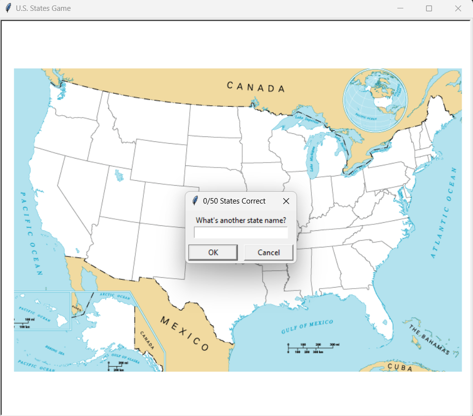
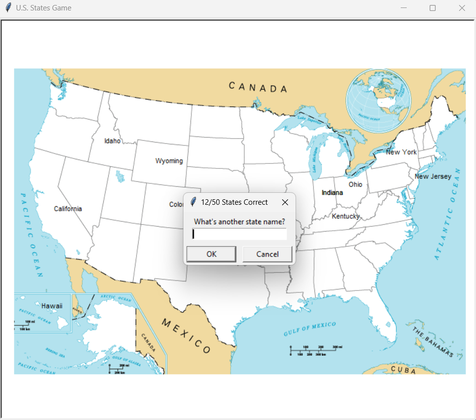

# 🗺️ U.S. States Geography Quiz Game  

An **interactive Python based educational game** that challenges players to test and expand their knowledge of U.S. geography. By combining **data visualization, geospatial coordinates, and real time user interaction**, the game transforms traditional learning into an engaging, visually intuitive experience.  

---

## 📖 Overview  

The **U.S. States Geography Quiz Game** is a **data driven educational tool** designed to help users memorize the names and locations of all 50 U.S. states. Leveraging Python’s **Turtle Graphics** for visualization and **Pandas** for dataset manipulation, the project integrates fun with functional learning.  

Players are prompted to guess the names of states, which are then dynamically rendered at their correct geographical positions on a **blank U.S. map**. Beyond entertainment, the project demonstrates the seamless fusion of **data science principles, geospatial mapping, and interactive programming**.  

This project demonstrates how **structured datasets**, **graphical programming**, **coordinate-based visualization**, and **real-time user interaction** can be combined to create an engaging educational application that transforms **geographical learning** into an **interactive and rewarding experience**.

---

## ⚙️ Technologies & Concepts Used  

This project leverages a combination of **Python libraries** and **software engineering concepts** to deliver an engaging and interactive gaming experience:  

- 🐍 **Python (Core Language)** – The primary programming language powering the entire application.  
- 🎨 **Turtle Graphics** – Used for rendering the U.S. map and dynamically placing state names at accurate coordinates.  
- 📊 **CSV Handling with Pandas** – Reads and processes the `50_states.csv` dataset to fetch state names and positional data.  
- 🖼️ **Image Integration** – `blank_states_img.gif` is embedded as a background canvas, simulating an interactive quiz map.  
- 💾 **Data Persistence** – Captures user guesses, validates against the dataset, and logs missed states for post game review.  
- 🧩 **Algorithmic Logic** – Implements input validation, string normalization, and conditional checks to ensure accuracy and robustness.  
- 🖥️ **Event driven Programming** – Waits for user input iteratively, updating the graphical interface in real time.  

---

## 🎮 Gameplay Mechanics  

The quiz is designed with **immersive, interactive, and pedagogically structured gameplay mechanics**, ensuring an experience that is both intuitive and intellectually stimulating:  

1. ✍️ **User Input Flow** – Players enter U.S. state names via the input prompt, which are programmatically validated against the dataset (`50_states.csv`).  
2. ✅ **Correct Guess Handling** – Upon a valid entry, the corresponding state name is dynamically **rendered on the map at its geospatial coordinates**, providing instant reinforcement.  
3. ❌ **Incorrect Guess Handling** – Invalid or duplicate inputs are gracefully discarded, preserving gameplay continuity and data integrity.  
4. 🎯 **Win Condition** – Progression continues until all **50 U.S. states** have been successfully identified or until the user manually exits.  
5. 📜 **Exit & Review Feature** – Exiting the game not only halts the interactive session but also triggers the generation of a **comprehensive list of unguessed states** for subsequent review.  
6. 💾 **Automated Knowledge Reinforcement** – On termination via the **Exit command in the GUI**, the application programmatically compiles and persists a `states_to_learn.csv` file, containing all the unguessed states. This dataset acts as a **personalized study aid**, ensuring that each gameplay session contributes to long term knowledge retention.  
7. 🖼️ **Real time Visual Feedback** – The map updates seamlessly in response to correct inputs, offering a **dynamic and visually engaging learning environment**.  
8. ⚡ **Optimized Loop Control** – An efficiently designed game loop ensures smooth execution and minimal memory overhead, maintaining peak runtime performance.  
9. 🎓 **Educational Utility** – Functions as a **gamified study tool**, reinforcing U.S. geography knowledge in an interactive format.  

---

## 📂 Project Structure

```
US-States-Geog-Quiz-Game/
    │── main.py                 # Core game logic with turtle graphics and pandas
    │── 50_states.csv           # Dataset of all 50 U.S. states with coordinates
    │── blank_states_img.gif    # Blank map of the U.S. for turtle rendering
    │── states_to_learn.csv     # (Auto generated) States missed during gameplay
    └── README.md               # Project documentation
```

---

### 🚀 How to Run

> ⚠️ Ensure you have **Python 3.10+** installed.

### Prerequisites
- Python 3.10 or above
- Compatible terminal or IDE (e.g., VS Code, PyCharm)

1. Install the required dependencies for GUI rendering (if not already present):
   ```bash
   Turtle Graphics is included with Python's standard library and does not require separate installation.
   ```

2. Install the required dependencies for data handling:
   ```bash
   pip install pandas
   ```

3. **Clone the repository**
   ```bash
   git clone https://github.com/your-username/US-States-Geog-Quiz-Game.git
   ```

4. **Navigate to the project folder**
   ```bash
   cd US-States-Geog-Quiz-Game
   ```

> 💡 **Optional – Windows Only:** If you encounter errors related to `TCL_LIBRARY` or `TK_LIBRARY`, ensure that your Python installation's Tcl paths are correctly set using `os.environ` at the beginning of your script:
   ```bash
   import os
   os.environ['TCL_LIBRARY'] = r'C:\Program Files\Python313\tcl\tcl8.6'
   os.environ['TK_LIBRARY'] = r'C:\Program Files\Python313\tcl\tk8.6'
   ```

5. **Run the script**
   ```bash
   python main.py
   ```

---

## 🖥️ Sample Output

1. **🔹 Initial Game State**  
   When the program is first executed, a **blank U.S. map** is displayed inside the GUI.  
   This map acts as the **interactive canvas** where users begin entering their guesses.  
   > *Think of this as your "Level Zero" — a clean geographical slate ready to be filled.*  

     

---

2. **🔹 Dynamic Gameplay in Progress**  
   As the user correctly types state names, the map **updates in real time** by labeling each correctly guessed state at its geographical location.  
   Simultaneously, a **progress tracker** (e.g., *12/50 States Correct*) appears in the GUI title bar, giving players instant insight into their performance.  

   - Correctly guessed states are **rendered on the map** with precise text placement.  
   - Incorrect guesses are ignored gracefully, allowing the user to try again without interruption.  
   - The gameplay continues seamlessly until the user achieves a perfect score *or* chooses to exit.  

     

---

3. **🔹 End of Session Report**  
   When the user decides to conclude the game, they can simply type the command **`exit`** into the GUI input box.  
   Upon doing so, the program **automatically generates a CSV file** named:  

### 📄 states_to_learn.csv

This file contains the **list of unguessed states** — i.e., the ones the player was unable to identify during the session.  

> 🗂️ *Example:* If a player missed `California`, `Texas`, and `Nevada`, the generated file will look like this:  
>
> ```
> California
> Texas
> Nevada
> ```
>
> ✅ This ensures that every game session doubles as a **personalized learning module**, enabling players to revisit and reinforce their geographical knowledge at their own pace.  

---

⚡ **In short:** Once you exit the GUI using the `"exit"` command, you walk away not just with your score, but also with a **data driven roadmap of states you still need to master.**  

---

🔁 **User Journey Flow:**  
**Start → Play → Exit → Learn**

---

## ✨ Key Highlights  

The **U.S. States Geography Quiz Game** is not merely a casual trivia challenge. It is a thoughtfully engineered project that blends **education, interactivity, and software design principles** into a cohesive learning experience.  

---

### 🗺️ Immersive Educational Gameplay  
- **Interactive Map Based Learning:**  
  Players actively engage with a **graphical U.S. map**, typing state names that are dynamically placed at their exact geographic coordinates.  
- **Seamless Real Time Feedback:**  
  Correct guesses instantly update the map, while incorrect or duplicate inputs are gracefully ignored, maintaining an uninterrupted flow.  
- **Progress Tracking Built In:**  
  The game header continuously updates with the current score (*e.g., 15/50 States Correct*), ensuring players always know where they stand.  
- **Exit & Reinforce System:**  
  A unique **“Exit & Learn” mechanism** generates a CSV file (`states_to_learn.csv`) containing only the states that were missed, Therefore turning gameplay into a **personalized study plan**.  

---

### ⚙️ Clean, Maintainable Code Design  
- **Structured Data Handling with Pandas:**  
  Efficient CSV reading, filtering, and export operations form the backbone of state validation and learning reinforcement.  
- **Event Driven Graphics with Turtle:**  
  Utilizes Python’s `turtle` module to render states dynamically on the GUI, making the map visually interactive without external libraries.  
- **Optimized Game Loop:**  
  Lightweight looping mechanisms ensure smooth execution without unnecessary memory overhead.  
- **Readable & Extendable Architecture:**  
  The project is easy to navigate and can be expanded (e.g., add regions, difficulty levels, or timed challenges).  

---

### 🚀 Learning Outcomes & Skill Development  
- **Applied Data Science Concepts:** Leveraged `pandas` for CSV parsing, data filtering, and exporting insights.  
- **Mastery of Coordinate Systems:** Accurately mapped textual data to (x, y) positions for precise graphical rendering.  
- **Event Handling Proficiency:** Designed real time user input handling within a controlled loop.  
- **Problem Solving Mindset:** Balanced user experience (e.g., ignoring duplicates) with robust back end logic.  
- **Educational Gamification:** Transformed static geography data into an engaging, interactive tool for knowledge retention.  

---

### 🌟 Future Expansion Opportunities  
- Add **difficulty tiers** (easy = multiple choice, hard = typed answers only).  
- Introduce **timer based scoring** for competitive gameplay.  
- Implement **regional quizzes** (e.g., East Coast, Midwest) for focused practice.  
- Enhance visuals with **animated transitions or color coded state highlights**.  
- Extend functionality into a **web app or mobile version** for broader accessibility.  

---

## 📜 Credits  

This project was inspired by my continuous journey to blend **Python programming with real world educational applications**. The foundational knowledge and motivation stem from **Dr. Angela Yu’s “100 Days of Code: The Complete Python Pro Bootcamp”**, which introduced the core concepts of GUI handling, turtle graphics, and CSV based data manipulation.  

Beyond the guided learning, I independently:  
- Integrated **CSV driven state validation**.  
- Designed the **exit mechanism with automatic `states_to_learn.csv` generation**.  
- Enhanced the **game loop for smooth, interruption free performance**.  
- Authored detailed **documentation and structured code comments** to elevate professionalism and clarity.  

Special acknowledgment goes to the Python open source ecosystem, particularly **Pandas** and **Turtle**, which made this project both achievable and scalable.  

This project stands as a demonstration of how **educational tools can be gamified** with Python, producing an outcome that is both enjoyable and intellectually enriching.  
